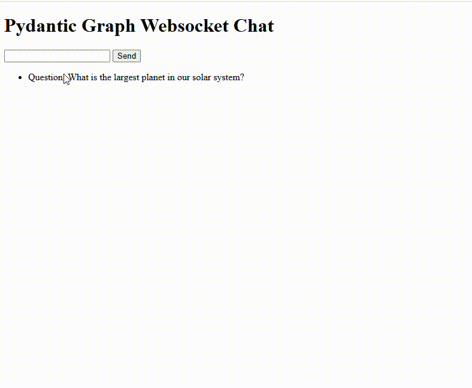

# pydanticai_graph_websocket
Pydantic Graph Chat with web UI using websocket

Built from https://ai.pydantic.dev/examples/question-graph/
The example in Pydantic was not showing how to use websockets, so I added that.



Step 1
```
.env with 
GROQ_API_KEY=xxxx
API_KEY=xxxx
```

Step 2
```
python3 -m venv venv
source venv/bin/activate
pip install -r requirements.txt
python main.py
```

Then open a browser on port 8000